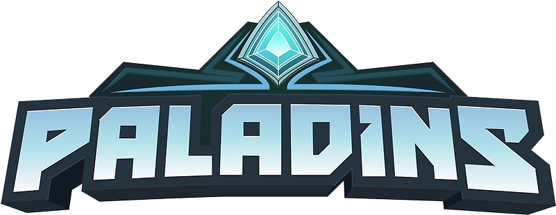

<br />
<p align="center">
  <a href="https://github.com/jalennguyen/paladins-predictor">
      
    </a>

  <h3 align="center">Live Match Prediction</h3>
  
  <p align="center">
    <a href="https://github.com/jalennguyen/paladins-predictor/issues">Report Bug</a>
    ·
    <a href="https://github.com/jalennguyen/paladins-predictor/issues">Request Feature</a>
  </p>
</p>


<!-- TABLE OF CONTENTS -->
<details open="open">
  <summary><h2 style="display: inline-block">Table of Contents</h2></summary>
  <ol>
    <li>
      <a href="#about-the-project">About The Project</a>
      <ul>
        <li><a href="#built-with">Built With</a></li>
      </ul>
    </li>
    <li>
      <a href="#getting-started">Getting Started</a>
      <ul>
        <li><a href="#prerequisites">Prerequisites</a></li>
        <li><a href="#installation">Installation</a></li>
      </ul>
    </li>
    <li><a href="#usage">Usage</a></li>
    <li><a href="#contributing">Contributing</a></li>
    <li><a href="#contact">Contact</a></li>
  </ol>
</details>


<!-- ABOUT THE PROJECT -->
## About The Project
 This is a personal project I made to predict the probability of a team winning a competitive match in Paladins. 
 I scraped over 1000 matches from Hi-Rez's API and then trained a Support Vector Classification model with the dataset.
 I was able to achieve an accuracy of **86%** by tuning the model's hyperparameters with Grid Search.
 I implemented the predictor through a Discord Bot where you can predict the outcome of a match in real time from within your own Discord Server.


### Built With

* [PyRez](https://pyrez.readthedocs.io/en/stable/api.html#paladinsapi) (Hi-Rez API wrapper for Python)
* [Scikit-learn](https://scikit-learn.org/stable/index.html)
* [discord.py](https://discordpy.readthedocs.io/en/stable/index.html)
* Python
* Jupyter Notebook
* Microsoft Excel


<!-- GETTING STARTED -->
## Getting Started

To get a local copy up and running follow these couple steps.

### Install dependencies
* dotenv
  ```sh
  $ pip install -U dotenv
  ```
* discord.py
  ```sh
  $ pip install -U discord.py
  ```
* pyrez
  ```sh
  $ pip install -U pyrez
  ```
* scikit-learn
  ```sh
  $ pip install -U scikit-learn
  ```

### Credentials
## Paladins
In order to access the Hi-Rez API, you need your own set of developer credentials. You can request them [here](https://fs12.formsite.com/HiRez/form48/secure_index.html).

## Discord
The model uses a Discord Bot as an interface to make predictions. To set up your own bot, go to https://discord.com/developers/applications , create an application, copy its Token (under the Bot tab) and invite it to your preferred server.


### Installation

1. Clone the repo
   ```sh
   git clone https://github.com/jalennguyen/paladins-predictor.git
   ```
2. Insert your Hi-Rez API developer id (devId), authentication key (authkey), and Discord Bot Token into the .env file.


<!-- USAGE EXAMPLES -->
## Usage

Once you have everything set up, run **bot.py** and use the command "!predict \<username\>" to start getting match predictions.
Remember, **always** take the model's predictions with a grain of salt. There are many variables that go into each game, the model does not represent the entire story - **GLHF**.


<!-- CONTRIBUTING -->
## Contributing

Contributions are what make the open source community such an amazing place to be learn, inspire, and create. Any contributions you make are **greatly appreciated**.

1. Fork the Project
2. Create your Feature Branch (`git checkout -b feature/AmazingFeature`)
3. Commit your Changes (`git commit -m 'Add some AmazingFeature'`)
4. Push to the Branch (`git push origin feature/AmazingFeature`)
5. Open a Pull Request


<!-- CONTACT -->
## Contact

Jalen Nguyen - jalennguyen@gmail.com - Jalen#3679

Project Link: [https://github.com/jalennguyen/paladins-predictor](https://github.com/jalennguyen/paladins-predictor)


<!-- MARKDOWN LINKS & IMAGES -->
<!-- https://www.markdownguide.org/basic-syntax/#reference-style-links -->
[contributors-shield]: https://img.shields.io/github/contributors/github_username/repo.svg?style=for-the-badge
[contributors-url]: https://github.com/github_username/repo/graphs/contributors
[forks-shield]: https://img.shields.io/github/forks/github_username/repo.svg?style=for-the-badge
[forks-url]: https://github.com/github_username/repo/network/members
[stars-shield]: https://img.shields.io/github/stars/github_username/repo.svg?style=for-the-badge
[stars-url]: https://github.com/github_username/repo/stargazers
[issues-shield]: https://img.shields.io/github/issues/github_username/repo.svg?style=for-the-badge
[issues-url]: https://github.com/github_username/repo/issues
[license-shield]: https://img.shields.io/github/license/github_username/repo.svg?style=for-the-badge
[license-url]: https://github.com/github_username/repo/blob/master/LICENSE.txt
[linkedin-shield]: https://img.shields.io/badge/-LinkedIn-black.svg?style=for-the-badge&logo=linkedin&colorB=555
[linkedin-url]: https://linkedin.com/in/github_username
