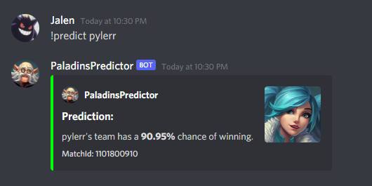

<br />
<p align="center">
  <a href="https://github.com/jalennguyen/paladins-predictor">
      
    </a>

  <h1 align="center">Live Match Prediction</h1>

</p>


<!-- ABOUT THE PROJECT -->
## About The Project
 This is a personal project I made to predict the probability of a team winning a competitive match in Paladins. 
 I scraped over 1000 matches from Hi-Rez's API and then trained a Support Vector Classification model with the dataset.
 I was able to achieve an accuracy of **86%** by tuning the model's hyperparameters with Grid Search.
 I implemented the predictor through a Discord Bot where you can predict the outcome of a match in real time from within your own Discord Server.


### Built With

* [PyRez](https://pyrez.readthedocs.io/en/stable/api.html#paladinsapi) (Hi-Rez API wrapper for Python)
* [Scikit-learn](https://scikit-learn.org/stable/index.html)
* [discord.py](https://discordpy.readthedocs.io/en/stable/index.html)
* Jupyter Notebook
* Microsoft Excel


<!-- GETTING STARTED -->
## Getting Started

To get a local copy up and running follow these couple steps.

### Install dependencies
* dotenv
  ```sh
  $ pip install -U dotenv
  ```
* discord.py
  ```sh
  $ pip install -U discord.py
  ```
* pyrez
  ```sh
  $ pip install -U pyrez
  ```
* scikit-learn
  ```sh
  $ pip install -U scikit-learn
  ```

### Credentials
## Paladins
In order to access the Hi-Rez API, you need your own set of developer credentials. You can request them [here](https://fs12.formsite.com/HiRez/form48/secure_index.html).

## Discord
The model uses a Discord Bot as an interface to make predictions. To set up your own bot, go to https://discord.com/developers/applications , create an application, copy its Token (under the Bot tab) and invite it to your preferred server.


### Installation

1. Clone the repo
   ```sh
   git clone https://github.com/jalennguyen/paladins-predictor.git
   ```
2. Insert your Hi-Rez API developer id (devId), authentication key (authkey), and Discord Bot Token into the environment (.env) file.


<!-- USAGE EXAMPLES -->
## Usage



Once you have everything set up, run **bot.py** and use the command "!predict \<username\>" to start getting match predictions.
Remember, **always** take the model's predictions with a grain of salt. There are many variables that go into each game, the model does not represent the entire story - **GLHF**.

